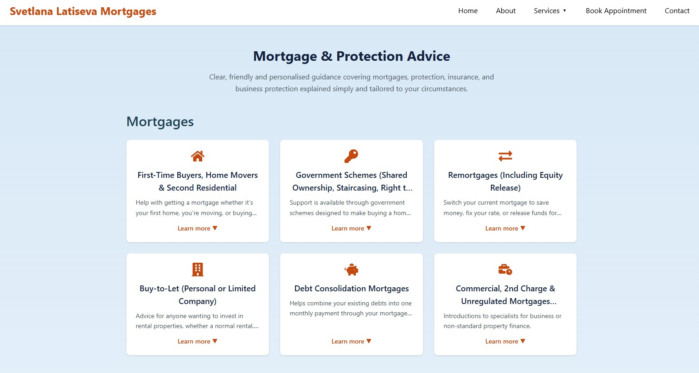

# 🏠 SL Mortgages Website

A professional, responsive mortgage and protection advisory website built for **Svetlana Latiseva Mortgages**, providing clear information, lead-generation tools, and full FCA compliance.

This project delivers a modern digital presence aligned with business goals: credibility, accessibility, automation, and scalability.

> 🔗 **Live Website (Work in Progress):** [https://sl-mortgages.netlify.app/](https://sl-mortgages.netlify.app/)

---

## 📸 Screenshots

| Home Page                                                                    | Services Page                                                              |
| ---------------------------------------------------------------------------- | -------------------------------------------------------------------------- |
|  |  |

---

## 🚀 Overview

The SL Mortgages website offers:

- **Professional service presentation** — showcases mortgage and protection services clearly and credibly
- **Streamlined client engagement** — quotation, appointment booking, and referral forms
- **Regulatory compliance** — FCA & Openwork disclaimers across all pages
- **Responsive, accessible design** — WCAG 2.2 AA compliant, mobile-first layout
- **Scalable foundation** — SEO-ready architecture with room for blog/CRM expansion

---

## 🧭 Core Features

### Pages & Navigation

| Page                             | Description                                                                                       |
| -------------------------------- | ------------------------------------------------------------------------------------------------- |
| **Home**                         | Hero section with value proposition, services overview (Mortgages & Protection Products), and CTA |
| **About**                        | Professional background and personal approach of the mortgage advisor                             |
| **Mortgage & Protection Advice** | Comprehensive service cards with expandable details for all offerings                             |
| **Quotation Portal**             | Multi-form quotation system (Purchase, Sale, Remortgage, Sale & Purchase, Survey)                 |
| **Book Appointment**             | Calendly integration for scheduling free virtual consultations                                    |
| **Testimonials**                 | Google Reviews integration with static fallback                                                   |
| **Partners**                     | Trusted lender partner showcase with animated marquee                                             |
| **Careers**                      | Career opportunities and application form                                                         |
| **Refer a Friend**               | Referral submission form for client recommendations                                               |
| **Contact**                      | Contact form and business information                                                             |
| **Terms of Use**                 | Legal terms and conditions                                                                        |

### Mortgage Services

| Category               | Services                                                                       |
| ---------------------- | ------------------------------------------------------------------------------ |
| **Residential**        | First-time buyers, Home movers, Second residential properties                  |
| **Government Schemes** | Shared Ownership, Staircasing, Right to Buy/Acquire, First Homes, Lifetime ISA |
| **Remortgages**        | Standard remortgages, Equity release                                           |
| **Buy-to-Let**         | Personal or Limited Company, HMO, Holiday Lets                                 |
| **Specialist**         | Debt consolidation, Commercial & unregulated mortgages (referrals)             |

### Protection Products

| Category                | Products                                                                                                                          |
| ----------------------- | --------------------------------------------------------------------------------------------------------------------------------- |
| **Core Protection**     | Life Cover, Critical Illness Cover, Income Protection, Accident & Sickness Multicover                                             |
| **Additional Cover**    | Global Treatment, Home Insurance, Private Medical Insurance (referrals), Commercial Insurance (referrals)                         |
| **Business Protection** | Relevant Life Plans, Key Person Cover, Shareholder & Partnership Protection, Business Loan Protection, Business Income Protection |

### Forms & Integrations

| Feature                | Description                                                                      |
| ---------------------- | -------------------------------------------------------------------------------- |
| **Quotation Forms**    | Purchase, Sale, Remortgage, Sale & Purchase, Survey quotations via Netlify Forms |
| **Referral Form**      | Client referral submission                                                       |
| **Career Application** | Job application form                                                             |
| **Contact Form**       | General enquiry form                                                             |
| **Calendly Embed**     | Appointment booking with preloading optimisation                                 |
| **Google Reviews**     | Live testimonial widget with static fallback                                     |
| **Partner Marquee**    | Animated lender logo carousel                                                    |

### UX & Accessibility

| Feature                    | Description                                              |
| -------------------------- | -------------------------------------------------------- |
| **WCAG 2.2 AA Compliance** | Semantic HTML, keyboard navigation, visible focus states |
| **Responsive Design**      | Mobile-first layout, optimised for all screen sizes      |
| **Cookie Consent**         | Non-intrusive banner with localStorage persistence       |
| **Scroll to Top**          | Smooth scroll navigation enhancement                     |
| **SEO Optimisation**       | Dynamic meta tags and structured data via React Helmet   |
| **FCA Compliance**         | Regulatory disclaimers and Openwork statements in footer |

---

## 🏗️ Tech Stack

| Area                     | Technology                                  |
| ------------------------ | ------------------------------------------- |
| **Framework**            | React + Vite                                |
| **Styling**              | Tailwind CSS                                |
| **Routing**              | React Router v6                             |
| **Forms**                | Formspree / EmailJS                         |
| **SEO**                  | React Helmet                                |
| **Hosting**              | Compatible with cPanel / Zone.eu / Netlify  |
| **Testing**              | Vitest + React Testing Library _(optional)_ |
| **Linting & Formatting** | ESLint + Prettier                           |

---

## 📂 Project Structure

```text
sl-mortgages/
├── assets/                    # Screenshots and documentation assets
├── src/
│   ├── components/
│   │   ├── layout/            # Header, Footer, Layout, CookieBanner, PartnerMarquee, ScrollToTop
│   │   ├── forms/             # CareersForm, ContactForm, ReferAFriendForm
│   │   │   └── Quotation/     # PurchaseForm, SaleForm, RemortgageForm, SaleAndPurchaseForm, SurveyForm
│   │   ├── features/          # GoogleReviews
│   │   └── ui/                # Button, Input, Checkbox, Select, Radio, Textarea, Alert, Tooltip
│   ├── pages/
│   │   ├── Home.tsx
│   │   ├── About.tsx
│   │   ├── MortgageProtectionAdvice.tsx
│   │   ├── Appointment.tsx
│   │   ├── Testimonials.tsx
│   │   ├── Partners.tsx
│   │   ├── Careers.tsx
│   │   ├── ReferAFriend.tsx
│   │   ├── Contact.tsx
│   │   ├── TermsOfUse.tsx
│   │   └── quotation/         # Index, Purchase, Sale, Remortgage, SaleAndPurchase, Survey
│   ├── lib/                   # Utilities and hooks
│   ├── styles/
│   ├── App.tsx
│   ├── main.tsx
│   └── routes.tsx
├── public/
│   └── assets/                # Favicon, images, partner logos
├── docs/
│   ├── prd.md
│   └── client-brief.md
└── package.json
```

---

## ⚙️ Installation & Setup

### 1️⃣ Clone the repo

```bash
git clone https://github.com/<your-username>/sl-mortgages.git
cd sl-mortgages
```

### 2️⃣ Install dependencies

```bash
npm install
```

### 3️⃣ Start development server

```bash
npm run dev
```

Visit [http://localhost:5173](http://localhost:5173) to preview.

### 4️⃣ Build for production

```bash
npm run build
```

### 5️⃣ Preview production build

```bash
npm run preview
```

---

## 🔑 Environment Variables

Create a `.env.local` file in the project root and include placeholders like:

```bash
VITE_FORMSPREE_ID=your_formspree_id
VITE_EMAILJS_SERVICE_ID=your_service_id
VITE_EMAILJS_TEMPLATE_ID=your_template_id
VITE_EMAILJS_PUBLIC_KEY=your_public_key
VITE_GOOGLE_CALENDAR_URL=your_calendar_embed_url
VITE_GOOGLE_PLACE_ID=ChIJvdBfFy5HxkkR1fX4HTL3tyg
```

_(Do not commit this file — it’s in `.gitignore`.)_

---

## 🌐 Deployment

Static build is compatible with:

- **Netlify** (drag-and-drop or CLI)
- **cPanel / Zone.eu** (upload `dist/` folder)
- **Vercel / GitHub Pages** (optional)

Ensure:

- All pages accessible over HTTPS
- DNS & SSL configured
- Environment variables set in hosting platform

---

## 📈 Success Metrics (Post-Launch)

- ≥ 10 quotation form submissions / month
- ≥ 5 appointment bookings / month
- ≥ 2 referral submissions / month
- Page load < 2 s, uptime ≥ 99.5%
- Positive user feedback and SEO growth

---

## 👥 Contributors

- **Svetlana Latiseva** — Client / Mortgage Advisor
- **Victoria Lauri** — Developer / Project Lead

---

## 🧾 License

© SL Mortgages — All rights reserved.  
For internal and client delivery only. Not open-source.
