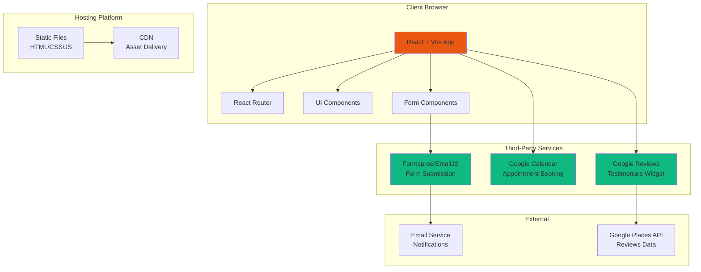

# Product Requirements Document: SL Mortgages Website

## 1. Executive Summary

### Primary Value Propositions

1. **Professional Service Presentation**: Clear, accessible showcase of mortgage and protection services that builds trust and credibility with potential clients
2. **Streamlined Client Engagement**: Integrated quotation requests, appointment booking, and referral programs reduce friction in the client acquisition process
3. **Regulatory Compliance**: Built-in FCA and Openwork disclaimers ensure legal compliance on every page, protecting the business
4. **Scalable Digital Presence**: Modern, responsive website foundation that can grow with business needs (blog, CRM integration, analytics)
5. **Social Proof Integration**: Google Reviews integration demonstrates credibility and encourages authentic client testimonials

### Strategic Alignment

This website aligns with SL Mortgages' core business objectives by:

- Establishing a professional digital presence that reflects the advisor's expertise and approachability
- Automating lead generation through integrated forms and appointment booking
- Ensuring FCA compliance through mandatory disclaimers and legal documentation
- Providing multiple touchpoints for client engagement (contact, booking, referrals, testimonials)
- Creating a scalable platform for future growth and feature additions

### Core Benefits

**For Users (Mortgage Seekers):**

- Easy access to mortgage and protection information 24/7
- Convenient quotation request and appointment booking without phone calls
- Transparent service presentation with clear contact options
- Ability to read authentic reviews and leave feedback

**For Business (SL Mortgages):**

- Professional online presence that builds credibility
- Automated lead capture through forms and appointment booking
- Reduced administrative overhead through self-service features
- Compliance-ready implementation with legal disclaimers
- Foundation for future digital marketing and CRM integration

### Success Definition

**Primary Success Criteria:**

- Website launched with all 9 core pages functional and responsive
- All forms successfully submitting to designated endpoints (Formspree/EmailJS)
- Google Calendar/Calendly integration operational for appointment booking
- Google Reviews widget displaying correctly with place ID
- FCA disclaimers present on every page
- WCAG 2.2 AA compliance achieved for accessibility
- Mobile-responsive design tested across major devices
- SEO optimization implemented (meta tags, structured data)
- Successful deployment to hosting platform (cPanel/Zone.eu/Netlify)

**Business Impact Metrics:**

- Quotation form submissions received within first month
- Appointment bookings through integrated calendar
- Referral form submissions
- User engagement time on key pages (Home, Services, About)
- Google Reviews widget click-through rate

---

## 2. Scope Definition

### In Scope

1. **Nine Core Pages**: Home, About Me, Conveyancer & Survey Quotation, Book Appointment, Career Opportunities, Refer a Friend, Testimonials, Partners, Footer (global)
2. **Interactive Forms**: Conveyancer quotation form, referral form, optional career application form with CV upload
3. **Third-Party Integrations**: Google Calendar/Calendly embed, Google Reviews widget, Formspree/EmailJS form handling
4. **Responsive Design**: Mobile-first, WCAG 2.2 AA compliant, accessible across all devices
5. **Legal Compliance**: FCA and Openwork disclaimers on every page, cookie consent banner, external legal links
6. **SEO Foundation**: React Helmet implementation, meta tags, structured data, semantic HTML
7. **Professional Design**: Orange/teal theme matching client leaflet, modern minimalist layout, professional typography

### Out of Scope

1. **User Authentication/Accounts**: No user login, registration, or account management features
2. **Content Management System**: No admin panel or CMS for content editing (static content managed via code)
3. **Payment Processing**: No payment integration or transaction handling
4. **Real-time Chat**: No live chat or instant messaging functionality
5. **Advanced Analytics Dashboard**: Basic analytics (Google Analytics) only, no custom reporting dashboard
6. **Multi-language Support**: English only, no internationalization

### Future Considerations

**Phase 2 Potential Features:**

- Blog/content management system for mortgage advice articles
- CRM integration (e.g., HubSpot, Salesforce) for lead management
- Advanced analytics dashboard with conversion tracking
- Email newsletter signup and automated campaigns
- Client portal for document sharing and application tracking
- Multi-language support for diverse client base
- Advanced appointment management with automated reminders
- Integration with mortgage calculation tools

---

## 3. Target Market & User Analysis

### 3.1 Ideal Customer Profile (ICP)

**Demographics:**

- **Location**: United Kingdom (England, Scotland, Wales, Northern Ireland)
- **Age Range**: 25-65 years old
- **Property Type**: First-time buyers, home movers, remortgage seekers, buy-to-let investors
- **Financial Profile**: Seeking mortgage advice, protection products, or commercial finance

**Property & Financial Characteristics:**

- Property values ranging from £100k to £1M+
- First-time buyers, home movers, or property investors
- Seeking mortgage products (residential, buy-to-let, commercial)
- Interested in protection products (life insurance, critical illness, income protection)
- May qualify for government schemes (Help to Buy, etc.)

**Technology Profile:**

- Comfortable using websites and mobile devices
- Expects modern, responsive web experience
- Values convenience (online forms, booking systems)
- May prefer digital-first engagement over phone calls

**Business Context:**

- Seeking professional mortgage advice
- Values transparency and regulatory compliance (FCA-regulated advisor)
- Appreciates personal service and local expertise
- Influenced by testimonials and social proof
- Decision timeframe: weeks to months for mortgage applications

**Success Criteria:**

- Successfully request and receive mortgage/conveyancer quotations
- Book initial consultation appointments
- Understand available services and advisor expertise
- Feel confident in advisor's qualifications and approach

### 3.2 User Personas

#### Persona 1: First-Time Buyer Fiona

**Demographics & Role:**

- Age: 28-35
- Occupation: Professional (teacher, nurse, office worker)
- Location: England, Scotland, Wales, or Northern Ireland
- First-time property buyer, limited mortgage knowledge

**Goals & Motivations:**

- Understand mortgage options available for first-time buyers
- Get clear, jargon-free advice about the mortgage process
- Find trustworthy advisor who can guide through unfamiliar process
- Access government schemes (Help to Buy) if eligible
- Secure mortgage approval for first property purchase

**Pain Points:**

- Overwhelmed by mortgage terminology and process complexity
- Uncertain about eligibility and deposit requirements
- Concerned about making expensive mistakes
- Limited time for phone calls during work hours
- Wants to compare options before committing to advisor

**Technical Proficiency:**

- High comfort with websites and mobile apps
- Prefers online research and forms over phone calls
- Expects modern, professional website design
- Values easy navigation and clear information

**Usage Patterns:**

- Initial research phase: Browse services, read about advisor, check testimonials
- Engagement: Submit quotation request, book appointment
- Frequency: 1-3 visits during mortgage search process
- Device: Primarily mobile during breaks, desktop for detailed research

**Decision Influence:**

- Primary decision maker for personal mortgage application
- May consult partner/family but makes final decision
- Influenced by reviews, testimonials, and advisor's approachability

---

#### Persona 2: Experienced Home Mover Martin

**Demographics & Role:**

- Age: 40-55
- Occupation: Established professional or business owner
- Location: UK-wide
- Previously owned property, moving to new home or remortgaging

**Goals & Motivations:**

- Compare remortgage options for better rates
- Get conveyancer and surveyor recommendations
- Secure commercial finance for business property
- Access competitive mortgage products through broker network
- Efficient, professional service without unnecessary complexity

**Pain Points:**

- Time constraints due to work and family commitments
- Wants quick, efficient service without lengthy processes
- Values expertise and access to wide range of lenders
- Previous negative experiences with unresponsive advisors
- Needs advisor who understands commercial finance

**Technical Proficiency:**

- Comfortable with technology but values simplicity
- Prefers straightforward interfaces over complex features
- May book appointments via website to save time
- Expects professional, polished digital presence

**Usage Patterns:**

- Quick research: Check services, availability, testimonials
- Direct action: Book appointment, request quote
- Frequency: 1-2 visits, focused on specific actions
- Device: Desktop for research, mobile for quick actions

**Decision Influence:**

- High decision-making authority
- Makes decisions based on efficiency and expertise
- Values time-saving features (online booking, quick quotes)
- Influenced by professional credentials and regulatory compliance

---

#### Persona 3: Career Seeker Chris

**Demographics & Role:**

- Age: 25-45
- Occupation: Sales professional, financial services background, or career changer
- Location: UK-wide (remote work potential)
- Interested in mortgage advisor career opportunities

**Goals & Motivations:**

- Learn about career opportunities in mortgage advisory
- Understand earning potential and commission structure
- Evaluate flexible working arrangements
- Submit application or CV for consideration
- Connect with advisor to discuss career path

**Pain Points:**

- Uncertain about industry entry requirements
- Wants clarity on earning potential and work-life balance
- Needs flexible hours or remote work options
- Looking for career development opportunities
- Requires clear information before making career change

**Technical Proficiency:**

- Comfortable with online applications and forms
- Expects professional career portal experience
- May upload CV or documents via website
- Values clear information and easy application process

**Usage Patterns:**

- Research: Read career opportunities page, understand roles
- Application: Submit CV or contact form
- Frequency: 1-2 visits during career exploration
- Device: Desktop for detailed reading, mobile for quick contact

**Decision Influence:**

- Personal career decision maker
- Influenced by earning potential, flexibility, and growth opportunities
- May consult family but makes own career decisions

---

#### Persona 4: Referrer Rachel

**Demographics & Role:**

- Age: 30-50
- Occupation: Varied (existing client or professional contact)
- Location: UK-wide
- Satisfied client or professional contact referring friend/colleague

**Goals & Motivations:**

- Refer friend or colleague to advisor
- Access referral program benefits (£50 reward)
- Support advisor's business growth
- Help friend access quality mortgage advice
- Submit referral quickly and easily

**Pain Points:**

- Wants simple, quick referral process
- Needs clear information about referral program terms
- Values transparency about reward timing and conditions
- Prefers online form over phone call

**Technical Proficiency:**

- Basic to intermediate web skills
- Comfortable with simple forms
- Expects straightforward process
- Values convenience and speed

**Usage Patterns:**

- Single visit: Navigate to referral page, submit form
- Frequency: One-time action per referral
- Device: Mobile or desktop, whichever is convenient

**Decision Influence:**

- Personal referral decision maker
- Influenced by ease of process and clear benefits
- Trusts advisor based on previous positive experience

---

## 4. User Stories & Acceptance Criteria

### 4.1 Core User Stories

#### Home Page & Services

**US-001**: As a **First-Time Buyer Fiona**, I want to see a clear overview of mortgage services offered so that I can understand if this advisor can help me.

**US-002**: As a **Home Mover Martin**, I want to quickly access contact information and booking options so that I can schedule a consultation efficiently.

**US-003**: As any **user**, I want to see professional, trustworthy design so that I feel confident in the advisor's expertise.

#### About Me Page

**US-004**: As a **First-Time Buyer Fiona**, I want to read about the advisor's background and approach so that I can assess if they're the right fit for me.

**US-005**: As any **user**, I want to understand the advisor's motivation and professional journey so that I can build trust before contacting them.

#### Conveyancer & Survey Quotation

**US-006**: As a **Home Mover Martin**, I want to request a conveyancer or survey quotation online so that I can get recommendations without making a phone call.

**US-007**: As a **First-Time Buyer Fiona**, I want to submit my property details and requirements so that I can receive a tailored quotation.

**US-008**: As any **user**, I want to receive confirmation that my quotation request was submitted successfully so that I know my request was received.

#### Book an Appointment

**US-009**: As a **Home Mover Martin**, I want to book an appointment directly through a calendar integration so that I can schedule at my convenience without phone calls.

**US-010**: As a **First-Time Buyer Fiona**, I want to see available appointment slots so that I can choose a time that works for me.

**US-011**: As any **user**, I want a fallback contact form if the calendar doesn't load so that I can still request an appointment.

#### Career Opportunities

**US-012**: As **Career Seeker Chris**, I want to read about available roles and earning potential so that I can evaluate if this career path suits me.

**US-013**: As **Career Seeker Chris**, I want to submit my CV or contact information so that I can apply for career opportunities.

#### Refer a Friend

**US-014**: As **Referrer Rachel**, I want to submit a referral with my friend's details so that I can participate in the referral program.

**US-015**: As **Referrer Rachel**, I want to see clear information about the referral reward (£50) and terms so that I understand the program benefits.

#### Testimonials

**US-016**: As a **First-Time Buyer Fiona**, I want to read Google Reviews from previous clients so that I can assess the advisor's reputation and service quality.

**US-017**: As any **user**, I want to leave a review so that I can share my experience with others.

#### Legal & Compliance

**US-018**: As any **user**, I want to see FCA and regulatory disclaimers so that I understand the legal context of the services.

**US-019**: As any **user**, I want to access privacy and terms information so that I understand how my data is handled.

### 4.2 Detailed User Flows

#### Primary Workflow 1: Request Conveyancer Quotation

**Steps:**

1. User navigates to "Conveyancer & Survey Quotation" page from navigation menu
2. User reads page content explaining the quotation service
3. User fills out form fields:
   - Selects deal type (Purchase/Sale/Remortgage/Survey)
   - Enters title, first name, last name
   - Selects location (England/Scotland/Wales/Northern Ireland)
   - Enters property price, tenure, address
   - Selects first-time buyer status (yes/no)
   - Checks applicable additional considerations (Auction, Buy to Let, Help to Buy, etc.)
4. User clicks "Submit" button
5. Form validates required fields (client-side validation)
6. Form submits via POST to Formspree/EmailJS endpoint
7. User sees success confirmation message
8. Advisor receives email notification with form data

**Success Scenario:**

- All required fields completed correctly
- Form submission successful
- Confirmation message displayed
- Email received by advisor within 1 minute

**Edge Cases:**

- Required field missing → Show inline validation error
- Invalid email format → Show format error
- Network error → Show error message with retry option
- Formspree/EmailJS service down → Show fallback contact information

**Acceptance Criteria:**

- Form validates all required fields before submission
- Form successfully submits to configured endpoint
- Success message displays for 5 seconds before optional redirect
- Email notification received with all form data
- Form clears after successful submission
- Error handling displays user-friendly messages

---

#### Primary Workflow 2: Book Appointment via Calendar

**Steps:**

1. User navigates to "Book an Appointment" page
2. User sees embedded Google Calendar/Calendly widget
3. User interacts with calendar widget to select date and time
4. User completes appointment booking through third-party system
5. User receives confirmation from calendar system
6. Advisor receives notification of new appointment

**Success Scenario:**

- Calendar widget loads successfully
- User selects available time slot
- Booking completes through integrated system
- Confirmation received

**Edge Cases:**

- Calendar widget fails to load → Display fallback contact form
- No available slots → Show message with alternative contact options
- User's browser blocks iframe → Provide direct link to calendar
- Third-party service unavailable → Show contact form and phone number

**Acceptance Criteria:**

- Calendar widget loads within 3 seconds
- Fallback contact form available if widget fails
- Widget is responsive and mobile-friendly
- Direct calendar link provided as alternative
- Contact information visible if booking unavailable

---

#### Primary Workflow 3: Submit Referral

**Steps:**

1. User navigates to "Refer a Friend" page
2. User reads referral program information (£50 reward, terms)
3. User fills referral form:
   - Referrer name and email
   - Friend name and email
4. User submits form
5. Confirmation message displays
6. Advisor receives referral notification

**Success Scenario:**

- Form completed with valid email addresses
- Submission successful
- Confirmation shown
- Email notification received

**Edge Cases:**

- Invalid email format → Show validation error
- Missing required fields → Show inline errors
- Duplicate referral → Accept but note in notification
- Network error → Show error with retry

**Acceptance Criteria:**

- Form validates email formats
- Both referrer and friend emails required
- Success confirmation displays
- Email notification includes both parties' information
- Terms and conditions clearly displayed

---

#### Primary Workflow 4: Browse Services and Read Testimonials

**Steps:**

1. User lands on home page
2. User reads hero section and service overview
3. User navigates to "Testimonials" page
4. User views Google Reviews widget
5. User clicks "Leave a Review" link
6. User redirected to Google review page

**Success Scenario:**

- All content loads quickly
- Google Reviews widget displays correctly
- Review link works and opens in new tab
- Navigation is smooth and intuitive

**Edge Cases:**

- Google Reviews widget fails → Show static testimonials fallback
- Slow loading → Show loading state
- No reviews available → Show message encouraging reviews

**Acceptance Criteria:**

- Home page loads in under 2 seconds
- Google Reviews widget loads with correct place ID
- Review link opens Google review page correctly
- Fallback content available if widget fails
- All images have alt text for accessibility

---

#### Primary Workflow 5: Explore Career Opportunities

**Steps:**

1. User navigates to "Career Opportunities" page
2. User reads about available roles and benefits
3. User reviews earning potential and flexibility information
4. User clicks contact link or fills optional application form
5. User submits CV (if form available) or sends email

**Success Scenario:**

- Clear information about roles displayed
- Contact options easily accessible
- Form submission successful (if used)
- CV upload works (if implemented)

**Edge Cases:**

- Large CV file → Show file size limit error
- Unsupported file type → Show accepted formats
- Form optional → Email/phone links always available

**Acceptance Criteria:**

- Career information clearly presented
- Multiple contact methods available
- Form accepts common CV formats (PDF, DOC, DOCX)
- File size limits enforced (e.g., 5MB max)
- Email and phone links functional

---

## 5. Feature Specifications

### 5.1 Feature Hierarchy

#### Feature: Home Page & Services Overview

- **Priority**: Critical
- **Complexity**: Simple
- **User Value Score**: High
- **Overview**: Primary landing page showcasing services, hero section, clear CTAs

#### Feature: About Me Page

- **Priority**: High
- **Complexity**: Simple
- **User Value Score**: High
- **Overview**: Personal story, professional background, builds trust

#### Feature: Conveyancer & Survey Quotation Form

- **Priority**: Critical
- **Complexity**: Moderate
- **User Value Score**: High
- **Overview**: Interactive form for quotation requests with validation and submission

#### Feature: Appointment Booking Integration

- **Priority**: Critical
- **Complexity**: Moderate
- **User Value Score**: High
- **Overview**: Google Calendar/Calendly embed with fallback contact form

#### Feature: Career Opportunities Page

- **Priority**: Medium
- **Complexity**: Simple
- **User Value Score**: Medium
- **Overview**: Recruitment content with optional application form

#### Feature: Refer a Friend Form

- **Priority**: High
- **Complexity**: Simple
- **User Value Score**: Medium
- **Overview**: Simple referral form with program information

#### Feature: Testimonials & Google Reviews

- **Priority**: High
- **Complexity**: Moderate
- **User Value Score**: High
- **Overview**: Google Reviews widget integration with fallback content

#### Feature: Partners Page

- **Priority**: Low
- **Complexity**: Simple
- **User Value Score**: Low
- **Overview**: Partner logos and affiliations display

#### Feature: Global Footer with Disclaimers

- **Priority**: Critical
- **Complexity**: Simple
- **User Value Score**: Medium (compliance requirement)
- **Overview**: FCA disclaimers, legal links, cookie banner on every page

### 5.2 Detailed Requirements

#### Feature: Conveyancer & Survey Quotation Form

**Functional Specifications:**

- Form displays on dedicated page with explanatory content
- Fields: Deal type (dropdown), Title (dropdown), First name (text), Last name (text), Location (radio/select), Property price (number), Tenure (text), Address (textarea), First-time buyer (radio yes/no), Additional considerations (checkboxes: Auction, Buy to Let, Help to Buy, Shared Ownership, Right to Buy, Other)
- Client-side validation for all required fields
- Email format validation where applicable
- Form submission via POST to Formspree/EmailJS endpoint
- Success confirmation message displayed after submission
- Form data cleared after successful submission
- Error handling with user-friendly messages

**User Interface Requirements:**

- Responsive form layout (mobile-first design)
- Accessible form labels and error messages
- Clear visual hierarchy and spacing
- Loading state during submission
- Success/error message styling (green/red indicators)
- Keyboard navigation support
- Focus management for accessibility

**Data Requirements:**

- Required fields: Deal type, First name, Last name, Location, Property price, Address
- Optional fields: Title, Tenure, Additional considerations
- Validation rules:
  - Names: 2-50 characters, letters and spaces only
  - Property price: Positive number, max 10 digits
  - Address: 10-500 characters
  - Email (if added): Valid email format
- Form submission payload structure:

```json
{
  "dealType": "Purchase|Sale|Remortgage|Survey",
  "title": "Mr|Mrs|Ms|Miss|Dr",
  "firstName": "string",
  "lastName": "string",
  "location": "England|Scotland|Wales|Northern Ireland",
  "propertyPrice": "number",
  "tenure": "string",
  "address": "string",
  "firstTimeBuyer": "yes|no",
  "additionalConsiderations": ["Auction", "Buy to Let", ...],
  "submittedAt": "ISO timestamp"
}
```

**Business Rules:**

- Deal type determines which quotation service is requested
- First-time buyer status may affect available schemes
- Additional considerations help advisor provide accurate quotes
- All submissions must be timestamped
- Advisor receives email notification immediately upon submission

**Integration Points:**

- Formspree endpoint: `https://formspree.io/f/{form_id}`
- OR EmailJS service: `https://api.emailjs.com/api/v1.0/email/send`
- Email notification includes all form data formatted for readability

**Performance Requirements:**

- Form loads in under 1 second
- Form submission completes within 3 seconds
- Validation feedback appears instantly (<100ms)
- Page should handle 100+ concurrent form submissions

---

#### Feature: Appointment Booking Integration

**Functional Specifications:**

- Page displays embedded Google Calendar or Calendly widget
- Widget loads in iframe with appropriate dimensions
- Fallback contact form displays if widget fails to load
- Direct link to calendar provided as alternative
- Phone number and email displayed prominently
- Widget is responsive and mobile-friendly

**User Interface Requirements:**

- Widget container: Minimum 600px height, full width on desktop
- Mobile optimization: Widget adapts to screen size
- Loading state while widget initializes
- Fallback form matches site design system
- Clear instructions for booking process
- Accessible iframe with title attribute

**Data Requirements:**

- Google Calendar embed code or Calendly URL provided by client
- Fallback form fields: Name, Email, Preferred date/time, Message
- No data storage required (handled by third-party service)

**Business Rules:**

- Primary booking method: Embedded calendar widget
- Fallback: Contact form or direct phone/email
- Advisor manages availability through calendar system
- Bookings sync automatically with advisor's calendar

**Integration Points:**

- Google Calendar embed: `<iframe src="https://calendar.google.com/calendar/embed?src={calendar_id}">`
- OR Calendly embed: `<div class="calendly-inline-widget" data-url="{calendly_url}">`
- Widget dimensions: Responsive, minimum 600px height

**Performance Requirements:**

- Widget loads within 3 seconds
- Fallback activates if widget fails within 5 seconds
- Page remains functional if third-party service is down

---

#### Feature: Google Reviews Integration

**Functional Specifications:**

- Google Reviews widget embedded on Testimonials page
- Widget displays reviews using provided place ID: `ChIJvdBfFy5HxkkR1fX4HTL3tyg`
- "Leave a Review" link redirects to Google review page
- Fallback static testimonials if widget fails
- Link opens in new tab with proper security attributes

**User Interface Requirements:**

- Widget container: Responsive, centered layout
- Minimum height: 400px for widget display
- Loading state while widget initializes
- Fallback testimonials styled consistently
- Review link clearly visible and accessible

**Data Requirements:**

- Google Place ID: `ChIJvdBfFy5HxkkR1fX4HTL3tyg`
- Review link URL: `https://search.google.com/local/writereview?placeid=ChIJvdBfFy5HxkkR1fX4HTL3tyg`
- Static fallback testimonials (optional, manually curated)

**Business Rules:**

- Widget displays live Google Reviews
- Reviews update automatically from Google
- No manual review moderation required
- Fallback content ensures page functionality if widget fails

**Integration Points:**

- Google Places API or Google Reviews widget script
- Widget script loaded from Google CDN
- Place ID embedded in widget configuration

**Performance Requirements:**

- Widget loads within 3 seconds
- Fallback activates if widget fails within 5 seconds
- No impact on page load time if widget loads asynchronously

---

#### Feature: Global Footer with Legal Disclaimers

**Functional Specifications:**

- Footer appears on every page of the website
- Contains mandatory FCA and Openwork disclaimers
- Includes external legal links (Terms, Privacy, Trading Terms)
- Cookie consent banner (optional, can be simple JS implementation)
- Footer is sticky or appears at bottom of page content

**User Interface Requirements:**

- Footer styling: Orange/teal theme, readable typography
- Disclaimer text: Clearly visible, appropriate font size
- Legal links: Styled as links, open in new tab
- Cookie banner: Non-intrusive, dismissible, appears on first visit
- Responsive: Stacks vertically on mobile, horizontal on desktop

**Data Requirements:**

- Mandatory disclaimer text (from client brief)
- External link URLs:
  - Terms: `https://business.yell.com/legal/terms-of-use/`
  - Privacy: `https://business.yell.com/websites-privacy-cookie-policy/`
  - Trading Terms: `https://business.yell.com/legal/trading-terms/`
- Cookie consent stored in localStorage (if implemented)

**Business Rules:**

- Disclaimers must appear on every page (legal requirement)
- Links must open in new tab to maintain user's place on site
- Cookie consent can be simple implementation (not required to be GDPR-compliant banner service)
- Footer content is static across all pages

**Integration Points:**

- No external integrations required
- Cookie consent can use simple JavaScript (localStorage)
- Optional: Third-party cookie consent service (Cookiebot, OneTrust)

**Performance Requirements:**

- Footer loads with page (no performance impact)
- Cookie banner script should not block page rendering

---

## 6. Technical Architecture & Implementation

### 6.1 Technology Stack & Architecture Decisions

**Frontend Framework: React + Vite**

- **Rationale**: Client requirement specifies React + Vite (not Next.js). Vite provides fast development experience, excellent HMR, and optimized production builds. React enables component reusability and modern UI development.

**Styling: Tailwind CSS**

- **Rationale**: Utility-first CSS framework enables rapid development, consistent design system, and easy responsive design. Matches client requirement and supports mobile-first approach.

**Routing: React Router DOM v6**

- **Rationale**: Industry-standard routing solution for React SPA. Enables client-side routing, nested routes, and programmatic navigation. Supports all 9 required pages.

**Form Handling: Formspree or EmailJS**

- **Rationale**: Serverless form solutions eliminate need for backend infrastructure. Formspree provides simple POST endpoint, EmailJS sends emails directly from client. Both are GDPR-compliant and easy to integrate.

**SEO: React Helmet**

- **Rationale**: Enables dynamic meta tag management for each page. Supports title, description, Open Graph tags, and structured data. Essential for search engine optimization.

**Hosting: Portable Deployment**

- **Rationale**: Client requires hosting flexibility (cPanel, Zone.eu, Netlify). Static site generation or build output supports all platforms. No server-side dependencies.

**Third-Party Integrations:**

- **Google Calendar/Calendly**: iframe embed (no API key required)
- **Google Reviews**: Widget script or Places API (API key may be needed)
- **Formspree/EmailJS**: REST API endpoints

**Development Tools:**

- **Build Tool**: Vite (bundler, dev server)
- **Package Manager**: npm or yarn
- **TypeScript**: Optional but recommended for type safety
- **ESLint + Prettier**: Code quality and formatting
- **Testing**: Vitest + React Testing Library (optional for MVP)

### 6.2 Application Scaffolding & Structure

```
sl-mortgages/
├── README.md
├── package.json
├── vite.config.js
├── tailwind.config.js
├── tsconfig.json (if using TypeScript)
├── .eslintrc.js
├── .prettierrc
├── .gitignore
├── public/
│   ├── favicon.ico
│   ├── assets/
│   │   ├── images/
│   │   ├── logos/
│   │   └── icons/
│   └── robots.txt
├── src/
│   ├── components/
│   │   ├── ui/
│   │   │   ├── Button.tsx
│   │   │   ├── Input.tsx
│   │   │   ├── Textarea.tsx
│   │   │   ├── Checkbox.tsx
│   │   │   ├── Radio.tsx
│   │   │   ├── Select.tsx
│   │   │   └── Alert.tsx
│   │   ├── layout/
│   │   │   ├── Header.tsx
│   │   │   ├── Navigation.tsx
│   │   │   ├── Footer.tsx
│   │   │   └── CookieBanner.tsx
│   │   ├── forms/
│   │   │   ├── QuotationForm.tsx
│   │   │   ├── ReferralForm.tsx
│   │   │   ├── ContactForm.tsx
│   │   │   └── CareerForm.tsx
│   │   └── features/
│   │       ├── GoogleReviews.tsx
│   │       ├── CalendarEmbed.tsx
│   │       └── ServiceCard.tsx
│   ├── pages/
│   │   ├── Home.tsx
│   │   ├── About.tsx
│   │   ├── Quotation.tsx
│   │   ├── Appointment.tsx
│   │   ├── Careers.tsx
│   │   ├── Referral.tsx
│   │   ├── Testimonials.tsx
│   │   └── Partners.tsx
│   ├── lib/
│   │   ├── utils/
│   │   │   ├── formValidation.ts
│   │   │   ├── formatters.ts
│   │   │   └── constants.ts
│   │   ├── hooks/
│   │   │   ├── useForm.ts
│   │   │   ├── useCookieConsent.ts
│   │   │   └── useSEO.ts
│   │   └── services/
│   │       ├── formspree.ts
│   │       └── emailjs.ts
│   ├── types/
│   │   ├── forms.ts
│   │   ├── pages.ts
│   │   └── components.ts
│   ├── styles/
│   │   ├── index.css
│   │   └── tailwind.css
│   ├── App.tsx
│   ├── main.tsx
│   └── routes.tsx
└── docs/
    ├── prd.md
    ├── client-brief.md
    └── deployment.md
```

**Component Hierarchy:**

- `App.tsx`: Root component with router and layout wrapper
- `Header.tsx`: Site header with navigation menu
- `Footer.tsx`: Global footer with disclaimers and links
- Page components: Individual route components
- Form components: Reusable form components with validation
- Feature components: Google Reviews, Calendar embed

**Routing Structure:**

```typescript
/ → Home
/about → About Me
/quotation → Conveyancer & Survey Quotation
/appointment → Book an Appointment
/careers → Career Opportunities
/referral → Refer a Friend
/testimonials → Testimonials
/partners → Partners
```

### 6.3 Database Schema Design

**Note**: This is a primarily static website with form submissions. Database is optional unless storing form submissions server-side. If using Formspree/EmailJS, no database required.

**Optional Database Schema (if storing submissions):**

```sql
-- Form submissions table (optional)
CREATE TABLE form_submissions (
  id UUID PRIMARY KEY DEFAULT gen_random_uuid(),
  form_type VARCHAR(50) NOT NULL, -- 'quotation', 'referral', 'career', 'contact'
  submission_data JSONB NOT NULL, -- Flexible JSON storage for form data
  submitted_at TIMESTAMP WITH TIME ZONE DEFAULT NOW(),
  processed BOOLEAN DEFAULT FALSE,
  notes TEXT
);

-- Index for querying by form type and date
CREATE INDEX idx_form_submissions_type_date ON form_submissions(form_type, submitted_at DESC);
CREATE INDEX idx_form_submissions_processed ON form_submissions(processed);

-- Cookie consent tracking (if implementing custom solution)
CREATE TABLE cookie_consents (
  id UUID PRIMARY KEY DEFAULT gen_random_uuid(),
  session_id VARCHAR(255) NOT NULL,
  consent_given BOOLEAN NOT NULL,
  consent_type VARCHAR(50), -- 'necessary', 'analytics', 'marketing'
  consented_at TIMESTAMP WITH TIME ZONE DEFAULT NOW(),
  ip_address INET,
  user_agent TEXT
);

CREATE INDEX idx_cookie_consents_session ON cookie_consents(session_id);
```

**If using Supabase:**

- Enable Row Level Security (RLS) on all tables
- Create policies for admin access only
- Form submissions table: Admin-only read/write access

**Migration Strategy:**

- Initial schema creation script
- Version-controlled migrations if schema evolves
- No migrations needed if using Formspree/EmailJS (serverless)

### 6.4 API Design & Endpoints

**Note**: Primary implementation uses third-party services (Formspree/EmailJS). No custom backend API required unless storing data server-side.

**Third-Party Endpoints:**

**Formspree Endpoint:**

```
POST https://formspree.io/f/{form_id}
Content-Type: application/json

Request Body:
{
  "dealType": "Purchase",
  "firstName": "John",
  "lastName": "Doe",
  ...
}

Response:
{
  "ok": true,
  "next": "https://formspree.io/thanks"
}
```

**EmailJS Endpoint:**

```
POST https://api.emailjs.com/api/v1.0/email/send
Content-Type: application/json

Request Body:
{
  "service_id": "{service_id}",
  "template_id": "{template_id}",
  "user_id": "{user_id}",
  "template_params": {
    "dealType": "Purchase",
    "firstName": "John",
    ...
  }
}

Response:
{
  "status": 200,
  "text": "OK"
}
```

**Optional Custom API Endpoints (if implementing backend):**

```
POST /api/submissions/quotation
  - Accepts quotation form data
  - Validates input
  - Stores in database
  - Sends email notification
  - Returns success/error response

POST /api/submissions/referral
  - Accepts referral form data
  - Validates emails
  - Stores in database
  - Sends email notification
  - Returns success/error response

POST /api/submissions/career
  - Accepts career application data
  - Handles file upload (CV)
  - Stores in database
  - Sends email notification
  - Returns success/error response

GET /api/health
  - Health check endpoint
  - Returns API status
```

**Error Handling:**

- Standard HTTP status codes (200, 400, 500)
- Error response format:

```json
{
  "error": true,
  "message": "User-friendly error message",
  "code": "ERROR_CODE",
  "details": {}
}
```

**Rate Limiting:**

- Formspree: Built-in rate limiting (varies by plan)
- EmailJS: Built-in rate limiting (varies by plan)
- Custom API: Implement rate limiting (e.g., 10 submissions per hour per IP)

### 6.5 System Architecture Diagram



**Architecture Notes:**

- **Frontend**: React SPA served as static files
- **Forms**: Submit directly to third-party services (no backend required)
- **Calendar**: Embedded iframe, no API integration needed
- **Reviews**: Widget script or Places API for dynamic content
- **Hosting**: Static site hosting (Netlify, cPanel, Zone.eu)
- **No Backend Required**: Formspree/EmailJS handle server-side processing

---

## 7. Detailed Task Breakdown & Planning

### 7.1 Development Tasks by Category

#### Infrastructure & Setup Tasks

**TASK-INFRA-001: Project Initialization**

- **Description**: Set up Vite + React project with TypeScript, Tailwind CSS, React Router
- **Acceptance Criteria**:
  - Project runs locally with `npm run dev`
  - TypeScript compilation successful
  - Tailwind CSS configured and working
  - React Router setup with basic routes
- **Dependencies**: None
- **Effort Estimate**: S
- **Required Skills**: React, Vite, TypeScript, Tailwind CSS
- **Priority Level**: Critical

**TASK-INFRA-002: Development Environment Configuration**

- **Description**: Configure ESLint, Prettier, Git, environment variables
- **Acceptance Criteria**:
  - ESLint rules configured
  - Prettier formatting working
  - .gitignore properly configured
  - Environment variables template created
- **Dependencies**: TASK-INFRA-001
- **Effort Estimate**: XS
- **Required Skills**: Tooling configuration
- **Priority Level**: High

**TASK-INFRA-003: Build & Deployment Configuration**

- **Description**: Configure production build, deployment scripts, hosting setup
- **Acceptance Criteria**:
  - Production build generates optimized static files
  - Build output ready for cPanel/Netlify/Zone.eu deployment
  - Deployment documentation created
- **Dependencies**: TASK-INFRA-001
- **Effort Estimate**: S
- **Required Skills**: Build tools, deployment
- **Priority Level**: High

#### Frontend Development Tasks

**TASK-FRONTEND-001: Layout Components (Header, Footer, Navigation)**

- **Description**: Build reusable header, footer, and navigation components
- **Acceptance Criteria**:
  - Header with logo and navigation menu
  - Footer with FCA disclaimers and legal links
  - Responsive mobile navigation (hamburger menu)
  - Footer appears on all pages
  - WCAG 2.2 AA compliant (keyboard navigation, focus states)
- **Dependencies**: TASK-INFRA-001
- **Effort Estimate**: M
- **Required Skills**: React, Tailwind CSS, Accessibility
- **Priority Level**: Critical

**TASK-FRONTEND-002: Home Page Implementation**

- **Description**: Build home page with hero section, services overview, CTAs
- **Acceptance Criteria**:
  - Hero section with headline and CTA button
  - Services sections (Mortgages, Protection Products)
  - Clear visual hierarchy
  - Responsive design (mobile-first)
  - SEO meta tags via React Helmet
- **Dependencies**: TASK-FRONTEND-001
- **Effort Estimate**: M
- **Required Skills**: React, Tailwind CSS, SEO
- **Priority Level**: Critical

**TASK-FRONTEND-003: About Me Page**

- **Description**: Create About Me page with advisor's story and background
- **Acceptance Criteria**:
  - Professional content layout
  - Readable typography
  - Responsive design
  - SEO optimized
- **Dependencies**: TASK-FRONTEND-001
- **Effort Estimate**: S
- **Required Skills**: React, Content Layout
- **Priority Level**: High

**TASK-FRONTEND-004: UI Component Library**

- **Description**: Build reusable UI components (Button, Input, Textarea, Select, Checkbox, Radio, Alert)
- **Acceptance Criteria**:
  - All components accessible (keyboard, screen readers)
  - Consistent styling with design system
  - Responsive and mobile-friendly
  - TypeScript types defined
- **Dependencies**: TASK-INFRA-001
- **Effort Estimate**: M
- **Required Skills**: React, TypeScript, Accessibility
- **Priority Level**: High

**TASK-FRONTEND-005: Quotation Form Component**

- **Description**: Build conveyancer & survey quotation form with validation
- **Acceptance Criteria**:
  - All required fields implemented
  - Client-side validation working
  - Form submission to Formspree/EmailJS
  - Success/error message display
  - Accessible form labels and error messages
- **Dependencies**: TASK-FRONTEND-004, TASK-FRONTEND-001
- **Effort Estimate**: L
- **Required Skills**: React, Form Handling, Validation
- **Priority Level**: Critical

**TASK-FRONTEND-006: Appointment Booking Page**

- **Description**: Create appointment page with calendar embed and fallback form
- **Acceptance Criteria**:
  - Google Calendar/Calendly iframe embedded
  - Responsive widget container
  - Fallback contact form if widget fails
  - Direct calendar link provided
  - Loading states handled
- **Dependencies**: TASK-FRONTEND-001, TASK-FRONTEND-004
- **Effort Estimate**: M
- **Required Skills**: React, Third-party Integration
- **Priority Level**: Critical

**TASK-FRONTEND-007: Referral Form Component**

- **Description**: Build referral form with program information
- **Acceptance Criteria**:
  - Simple form with referrer and friend details
  - Email validation
  - Form submission working
  - Program terms displayed
  - Success confirmation
- **Dependencies**: TASK-FRONTEND-004
- **Effort Estimate**: S
- **Required Skills**: React, Form Handling
- **Priority Level**: High

**TASK-FRONTEND-008: Testimonials Page with Google Reviews**

- **Description**: Create testimonials page with Google Reviews widget
- **Acceptance Criteria**:
  - Google Reviews widget embedded with correct place ID
  - "Leave a Review" link functional
  - Fallback static testimonials if widget fails
  - Responsive layout
- **Dependencies**: TASK-FRONTEND-001
- **Effort Estimate**: M
- **Required Skills**: React, Third-party Integration
- **Priority Level**: High

**TASK-FRONTEND-009: Career Opportunities Page**

- **Description**: Build careers page with role descriptions and optional form
- **Acceptance Criteria**:
  - Clear role descriptions
  - Benefits and earning potential highlighted
  - Contact links functional
  - Optional CV upload form (if implemented)
- **Dependencies**: TASK-FRONTEND-001, TASK-FRONTEND-004
- **Effort Estimate**: M
- **Required Skills**: React, File Upload (optional)
- **Priority Level**: Medium

**TASK-FRONTEND-010: Partners Page**

- **Description**: Create partners page with logo display
- **Acceptance Criteria**:
  - Partner logos displayed (grid or carousel)
  - Responsive layout
  - Professional presentation
- **Dependencies**: TASK-FRONTEND-001
- **Effort Estimate**: S
- **Required Skills**: React, Layout
- **Priority Level**: Low

**TASK-FRONTEND-011: Cookie Consent Banner**

- **Description**: Implement cookie consent banner component
- **Acceptance Criteria**:
  - Banner appears on first visit
  - Dismissible with localStorage persistence
  - Non-intrusive design
  - Accessible (keyboard dismissible)
- **Dependencies**: TASK-FRONTEND-001
- **Effort Estimate**: S
- **Required Skills**: React, localStorage
- **Priority Level**: Medium

**TASK-FRONTEND-012: SEO Implementation (React Helmet)**

- **Description**: Add SEO meta tags to all pages
- **Acceptance Criteria**:
  - Unique title and description for each page
  - Open Graph tags for social sharing
  - Structured data (optional)
  - Meta tags render correctly
- **Dependencies**: All page components
- **Effort Estimate**: M
- **Required Skills**: SEO, React Helmet
- **Priority Level**: High

#### Integration Tasks

**TASK-INTEGRATION-001: Formspree/EmailJS Integration**

- **Description**: Configure form submission endpoints
- **Acceptance Criteria**:
  - Formspree or EmailJS account setup
  - Form endpoints configured
  - Test submissions successful
  - Email notifications received
- **Dependencies**: TASK-FRONTEND-005, TASK-FRONTEND-007
- **Effort Estimate**: S
- **Required Skills**: Third-party API Integration
- **Priority Level**: Critical

**TASK-INTEGRATION-002: Google Calendar/Calendly Setup**

- **Description**: Configure calendar embed and obtain embed code/URL
- **Acceptance Criteria**:
  - Calendar account setup (Google Calendar or Calendly)
  - Embed code/URL obtained
  - Embed tested and working
  - Fallback options prepared
- **Dependencies**: TASK-FRONTEND-006
- **Effort Estimate**: S
- **Required Skills**: Calendar Service Configuration
- **Priority Level**: Critical

**TASK-INTEGRATION-003: Google Reviews Widget Setup**

- **Description**: Configure Google Reviews widget with place ID
- **Acceptance Criteria**:
  - Google Place ID verified
  - Widget script loaded correctly
  - Reviews displaying
  - Review link functional
- **Dependencies**: TASK-FRONTEND-008
- **Effort Estimate**: S
- **Required Skills**: Google Places API/Widget
- **Priority Level**: High

#### Quality Assurance Tasks

**TASK-QA-001: Accessibility Audit & Fixes**

- **Description**: Test and fix accessibility issues (WCAG 2.2 AA)
- **Acceptance Criteria**:
  - Keyboard navigation works on all pages
  - Screen reader compatibility tested
  - Color contrast meets WCAG standards
  - Focus indicators visible
  - Alt text on all images
- **Dependencies**: All frontend tasks
- **Effort Estimate**: M
- **Required Skills**: Accessibility Testing
- **Priority Level**: Critical

**TASK-QA-002: Cross-Browser Testing**

- **Description**: Test website on Chrome, Firefox, Safari, Edge
- **Acceptance Criteria**:
  - All features work on major browsers
  - No visual regressions
  - Forms submit correctly
  - Responsive design consistent
- **Dependencies**: All frontend tasks
- **Effort Estimate**: M
- **Required Skills**: Browser Testing
- **Priority Level**: High

**TASK-QA-003: Mobile Responsiveness Testing**

- **Description**: Test on various mobile devices and screen sizes
- **Acceptance Criteria**:
  - Mobile-first design works on phones (320px+)
  - Tablet layout optimized
  - Touch targets adequate size
  - Forms usable on mobile
- **Dependencies**: All frontend tasks
- **Effort Estimate**: M
- **Required Skills**: Responsive Design Testing
- **Priority Level**: Critical

**TASK-QA-004: Form Submission Testing**

- **Description**: Test all forms with various inputs and edge cases
- **Acceptance Criteria**:
  - Validation works correctly
  - Error messages clear
  - Success flows complete
  - Email notifications received
  - Edge cases handled (network errors, invalid input)
- **Dependencies**: TASK-INTEGRATION-001
- **Effort Estimate**: M
- **Required Skills**: Testing, Form Validation
- **Priority Level**: Critical

**TASK-QA-005: Performance Testing**

- **Description**: Test page load times and performance metrics
- **Acceptance Criteria**:
  - Home page loads in under 2 seconds
  - Forms respond quickly
  - Images optimized
  - Lighthouse score > 90
- **Dependencies**: All frontend tasks
- **Effort Estimate**: S
- **Required Skills**: Performance Optimization
- **Priority Level**: High

#### Deployment Tasks

**TASK-DEPLOY-001: Production Build Optimization**

- **Description**: Optimize production build for deployment
- **Acceptance Criteria**:
  - Build generates optimized static files
  - Assets minified and compressed
  - Source maps excluded (or separate)
  - Build size optimized
- **Dependencies**: All development tasks
- **Effort Estimate**: S
- **Required Skills**: Build Optimization
- **Priority Level**: High

**TASK-DEPLOY-002: Hosting Platform Setup**

- **Description**: Deploy to chosen hosting platform (cPanel/Netlify/Zone.eu)
- **Acceptance Criteria**:
  - Website accessible via domain
  - HTTPS enabled
  - All pages load correctly
  - Forms submit successfully
  - Environment variables configured
- **Dependencies**: TASK-DEPLOY-001
- **Effort Estimate**: M
- **Required Skills**: Deployment, Hosting
- **Priority Level**: Critical

**TASK-DEPLOY-003: Domain & DNS Configuration**

- **Description**: Configure domain and DNS settings
- **Acceptance Criteria**:
  - Domain points to hosting
  - SSL certificate active
  - www and non-www redirects configured
  - DNS propagation complete
- **Dependencies**: TASK-DEPLOY-002
- **Effort Estimate**: S
- **Required Skills**: DNS Configuration
- **Priority Level**: High

### 7.2 Impact–Effort Matrix Analysis

#### Quick Wins (High Impact, Low Effort)

1. **Home Page Implementation** (TASK-FRONTEND-002)

   - **Impact**: High - Primary landing page, first impression
   - **Effort**: Medium - Straightforward content page
   - **Timeline**: Week 1
   - **Resources**: 1 developer

2. **Layout Components** (TASK-FRONTEND-001)

   - **Impact**: High - Used across all pages
   - **Effort**: Medium - Foundation for entire site
   - **Timeline**: Week 1
   - **Resources**: 1 developer

3. **UI Component Library** (TASK-FRONTEND-004)
   - **Impact**: High - Reusable across forms and pages
   - **Effort**: Medium - One-time setup, multiple uses
   - **Timeline**: Week 1-2
   - **Resources**: 1 developer

#### Major Projects (High Impact, High Effort)

1. **Quotation Form** (TASK-FRONTEND-005)

   - **Impact**: High - Core lead generation feature
   - **Effort**: Large - Complex form with validation and integration
   - **Timeline**: Week 2-3
   - **Resources**: 1 developer + QA
   - **Risk Mitigation**: Start with simple validation, iterate

2. **Complete Frontend Implementation**
   - **Impact**: High - All pages functional
   - **Effort**: Large - Multiple pages and components
   - **Timeline**: Weeks 1-4
   - **Resources**: 1-2 developers
   - **Risk Mitigation**: Prioritize critical pages first

#### Fill-In Tasks (Low Impact, Low Effort)

1. **Partners Page** (TASK-FRONTEND-010)

   - **Impact**: Low - Nice to have, showcases affiliations
   - **Effort**: Small - Simple layout page
   - **Timeline**: Week 3-4
   - **Resources**: 1 developer (can be done in parallel)

2. **Cookie Consent Banner** (TASK-FRONTEND-011)
   - **Impact**: Low - Compliance feature, minimal user value
   - **Effort**: Small - Simple component
   - **Timeline**: Week 3
   - **Resources**: 1 developer

#### Avoid/Reassess (Low Impact, High Effort)

1. **Custom Backend API**

   - **Impact**: Low - Formspree/EmailJS sufficient for MVP
   - **Effort**: Very Large - Requires backend infrastructure
   - **Recommendation**: Avoid for MVP, consider Phase 2 if needed

2. **Advanced Analytics Dashboard**
   - **Impact**: Low - Basic analytics sufficient initially
   - **Effort**: Large - Custom dashboard development
   - **Recommendation**: Use Google Analytics for MVP, custom dashboard in Phase 2

---

## 8. Implementation Roadmap

### 8.1 Phase Planning

#### Phase 1: Foundation (MVP) - Weeks 1-4

**Duration Estimate**: 4 weeks

**Core Features:**

- All 9 pages implemented and functional
- Layout components (Header, Footer, Navigation)
- Quotation form with Formspree/EmailJS integration
- Appointment booking page with calendar embed
- Referral form
- Google Reviews integration
- FCA disclaimers on all pages
- Responsive design (mobile-first)
- Basic SEO implementation

**Success Criteria:**

- Website deployed and accessible
- All forms submitting successfully
- Calendar embed working
- Google Reviews displaying
- WCAG 2.2 AA compliance achieved
- Cross-browser compatibility verified
- Mobile responsiveness tested

**Resource Requirements:**

- 1-2 Frontend developers (React, TypeScript, Tailwind CSS)
- 1 QA tester (accessibility, cross-browser testing)
- 1 Designer (content review, design consistency)

**Key Deliverables:**

- Deployed website on chosen hosting platform
- All pages functional and tested
- Form integrations working
- Documentation for maintenance and updates

---

#### Phase 2: Enhancement - Weeks 5-6

**Duration Estimate**: 2 weeks

**Advanced Features:**

- Enhanced SEO (structured data, Open Graph optimization)
- Performance optimization (image optimization, code splitting)
- Advanced form validation and error handling
- Cookie consent banner implementation
- Analytics integration (Google Analytics)
- Additional content enhancements based on feedback

**Performance Optimization:**

- Image optimization and lazy loading
- Code splitting for faster initial load
- Asset compression and caching
- Lighthouse score > 90

**Extended Integrations:**

- Google Analytics setup
- Enhanced Google Reviews integration (if needed)
- Optional: Social media sharing optimization

**Success Metrics:**

- Page load times < 2 seconds
- Lighthouse performance score > 90
- Analytics tracking functional
- Improved SEO rankings

---

#### Phase 3: Scale & Expand - Future

**Advanced Features:**

- Blog/content management system
- CRM integration (HubSpot, Salesforce)
- Advanced analytics dashboard
- Email newsletter signup
- Client portal (document sharing)
- Multi-language support
- Advanced appointment management with reminders

**Analytics & Reporting:**

- Custom analytics dashboard
- Conversion tracking
- User behavior analysis
- A/B testing capabilities

**Advanced Integrations:**

- CRM integration for lead management
- Email marketing platform integration
- Advanced calendar features (automated reminders)
- Mortgage calculation tools

**Market Expansion:**

- Additional service pages
- Regional content variations
- Multi-language support

---

### 8.2 Risk Management & Dependencies

#### Cross-Phase Dependencies

- **Phase 1 → Phase 2**: Phase 2 enhancements depend on Phase 1 foundation
- **Phase 2 → Phase 3**: Phase 3 features build on Phase 2 optimizations

#### External Dependencies

1. **Third-Party Services:**

   - **Risk**: Formspree/EmailJS service availability
   - **Mitigation**: Have backup service ready, implement fallback contact forms
   - **Contingency**: Switch to alternative service or custom backend

2. **Google Services:**

   - **Risk**: Google Calendar/Reviews API changes or availability
   - **Mitigation**: Use iframe embeds (more stable), have fallback options
   - **Contingency**: Implement alternative calendar solution or static testimonials

3. **Hosting Platform:**

   - **Risk**: Hosting platform limitations or downtime
   - **Mitigation**: Choose reliable hosting provider, implement CDN
   - **Contingency**: Backup hosting option ready

4. **Content & Assets:**
   - **Risk**: Client content delays or missing assets
   - **Mitigation**: Use placeholder content initially, request content early
   - **Contingency**: Use professional stock images, placeholder text

#### Risk Mitigation Strategies

**Technical Risks:**

- **Form Submission Failures**: Implement retry logic, fallback email
- **Third-Party Service Downtime**: Fallback options for all integrations
- **Browser Compatibility**: Test early and often, use polyfills if needed
- **Performance Issues**: Optimize from start, monitor performance metrics

**Business Risks:**

- **Scope Creep**: Clear scope definition, change request process
- **Timeline Delays**: Buffer time in estimates, prioritize critical features
- **Content Delays**: Request content early, use placeholders

**Compliance Risks:**

- **FCA Compliance**: Legal review of disclaimers, ensure all pages have required text
- **GDPR Compliance**: Cookie consent implementation, privacy policy links
- **Accessibility**: WCAG 2.2 AA compliance testing throughout development

#### Contingency Planning

**If Formspree/EmailJS Fails:**

- Switch to alternative service (FormSubmit, Netlify Forms)
- Implement custom backend endpoint (PHP, Node.js)
- Use email mailto links as temporary fallback

**If Calendar Integration Fails:**

- Provide direct calendar link
- Implement custom contact form with date/time selection
- Use phone/email booking as primary method

**If Google Reviews Widget Fails:**

- Display static testimonials manually curated
- Link to Google Reviews page directly
- Implement custom reviews section

---

## 9. Success Metrics & KPIs

### 9.1 Business Metrics

**Revenue Impact:**

- **Quotation Requests**: Target 10+ submissions per month (baseline: 0)
- **Appointment Bookings**: Target 5+ bookings per month via website (baseline: 0)
- **Referral Submissions**: Target 2+ referrals per month (baseline: 0)
- **Conversion Rate**: Quote requests to appointments: Target 30%+ conversion

**Customer Metrics:**

- **Website Traffic**: Target 500+ unique visitors per month (baseline: 0)
- **Engagement Rate**: Average session duration > 2 minutes
- **Bounce Rate**: Target < 60% (industry average for service websites)
- **Contact Method Usage**: Track phone vs. form vs. calendar bookings

**Operational Efficiency:**

- **Time Savings**: Reduced phone calls for basic inquiries (target 20% reduction)
- **Lead Quality**: Higher quality leads from website forms vs. cold calls
- **Administrative Reduction**: Automated form submissions reduce manual data entry

**Market Position:**

- **Online Presence**: Professional website establishes digital credibility
- **Competitive Advantage**: Modern, accessible website vs. competitors
- **Brand Perception**: Improved trust through professional online presence

### 9.2 Product & User Metrics

**Adoption Metrics:**

- **Page Views**: Home page (target: 40% of total), Quotation page (target: 25%), Appointment page (target: 20%)
- **Feature Usage**:
  - Quotation form submissions: Target 10+ per month
  - Appointment bookings: Target 5+ per month
  - Referral form submissions: Target 2+ per month
- **Engagement Depth**: Pages per session > 2.5, time on site > 2 minutes

**Quality Metrics:**

- **Form Error Rate**: < 5% of submissions have validation errors
- **Form Success Rate**: > 95% of valid submissions succeed
- **Page Load Time**: < 2 seconds for all pages
- **Uptime**: 99.5%+ website availability
- **Error Rate**: < 1% JavaScript errors

**User Experience:**

- **Task Completion Rate**:
  - Quotation form: > 80% completion rate
  - Appointment booking: > 70% completion rate
- **User Satisfaction**: No critical usability issues reported
- **Support Tickets**: < 2 website-related support requests per month
- **Accessibility**: WCAG 2.2 AA compliance maintained

**Growth Metrics:**

- **Traffic Growth**: 10% month-over-month growth in first 6 months
- **Return Visitors**: Target 20%+ return visitor rate
- **Organic Search**: Target 30%+ traffic from organic search
- **Mobile Usage**: Target 60%+ mobile traffic (mobile-first design)

### 9.3 Technical Metrics

**Performance:**

- **Page Load Time**: < 2 seconds (Lighthouse Performance score > 90)
- **Time to Interactive**: < 3 seconds
- **First Contentful Paint**: < 1.5 seconds
- **Largest Contentful Paint**: < 2.5 seconds
- **Cumulative Layout Shift**: < 0.1

**Development Velocity:**

- **Code Quality**: ESLint errors: 0, TypeScript errors: 0
- **Test Coverage**: > 70% for critical components (if tests implemented)
- **Deployment Frequency**: Weekly deployments during development, as-needed post-launch
- **Bug Rate**: < 5 critical bugs per release

**Security & Compliance:**

- **Vulnerability Scans**: Monthly automated scans, 0 critical vulnerabilities
- **HTTPS**: 100% of pages served over HTTPS
- **GDPR Compliance**: Cookie consent implemented, privacy policy accessible
- **FCA Compliance**: Disclaimers present on 100% of pages

**Scalability:**

- **Resource Utilization**: Low server resource usage (static site)
- **CDN Performance**: Assets served via CDN with < 100ms response time
- **Form Submission Capacity**: Handle 100+ concurrent submissions
- **Traffic Capacity**: Support 10,000+ monthly visitors without performance degradation

### 9.4 Measurement Framework

#### Quotation Form Submissions

**Baseline**: 0 submissions  
**Target Goal**: 10+ submissions per month by month 3  
**Data Collection**: Formspree/EmailJS dashboard, email notifications  
**Reporting Schedule**: Weekly during first month, monthly thereafter  
**Action Triggers**: < 5 submissions per month after month 2 → Review form placement and CTAs

#### Appointment Bookings

**Baseline**: 0 bookings via website  
**Target Goal**: 5+ bookings per month by month 3  
**Data Collection**: Calendar service dashboard, manual tracking  
**Reporting Schedule**: Weekly during first month, monthly thereafter  
**Action Triggers**: < 2 bookings per month after month 2 → Review calendar placement and fallback options

#### Website Traffic

**Baseline**: 0 visitors  
**Target Goal**: 500+ unique visitors per month by month 3  
**Data Collection**: Google Analytics  
**Reporting Schedule**: Weekly during first month, monthly thereafter  
**Action Triggers**: < 200 visitors per month after month 2 → Review SEO and marketing efforts

#### Page Load Performance

**Baseline**: N/A (new site)  
**Target Goal**: < 2 seconds page load time, Lighthouse score > 90  
**Data Collection**: Lighthouse audits, Google PageSpeed Insights  
**Reporting Schedule**: Monthly performance audits  
**Action Triggers**: Page load > 3 seconds or Lighthouse score < 80 → Performance optimization required

#### Form Completion Rate

**Baseline**: N/A  
**Target Goal**: > 80% completion rate for quotation form  
**Data Collection**: Form analytics (started vs. completed)  
**Reporting Schedule**: Monthly review  
**Action Triggers**: Completion rate < 60% → Review form length and field requirements

#### Accessibility Compliance

**Baseline**: N/A  
**Target Goal**: WCAG 2.2 AA compliance maintained  
**Data Collection**: Automated accessibility testing (axe-core, WAVE), manual testing  
**Reporting Schedule**: Pre-launch audit, quarterly reviews  
**Action Triggers**: Critical accessibility issues found → Immediate fixes required

---

## 10. Quality Assurance & Testing Strategy

### 10.1 Testing Approach

#### Unit Testing

- **Scope**: Reusable components, utility functions, form validation logic
- **Tools**: Vitest + React Testing Library (optional for MVP)
- **Coverage Target**: > 70% for critical components (forms, validation)
- **Focus Areas**:
  - Form validation functions
  - Utility functions (formatters, validators)
  - Component rendering and props
  - Error handling logic

#### Integration Testing

- **Scope**: Form submissions, third-party integrations, API calls
- **Tools**: Vitest + React Testing Library, Mock Service Worker (MSW)
- **Coverage Target**: Critical user flows (form submission, calendar embed)
- **Focus Areas**:
  - Form submission to Formspree/EmailJS
  - Error handling for failed submissions
  - Calendar widget loading and fallback
  - Google Reviews widget loading

#### User Acceptance Testing

- **Scope**: End-to-end user workflows, real-world scenarios
- **Participants**: Client (Svetlana), potential users, stakeholders
- **Test Scenarios**:
  - Complete quotation form submission flow
  - Book appointment via calendar
  - Submit referral form
  - Navigate all pages and verify content
  - Test on actual mobile devices
- **Success Criteria**: All critical user flows complete successfully, no blocking issues

#### Performance Testing

- **Scope**: Page load times, form submission speed, third-party widget loading
- **Tools**: Lighthouse, Google PageSpeed Insights, WebPageTest
- **Metrics**:
  - Page load time < 2 seconds
  - Time to Interactive < 3 seconds
  - Lighthouse Performance score > 90
  - Form submission < 3 seconds
- **Focus Areas**:
  - Initial page load
  - Image optimization
  - JavaScript bundle size
  - Third-party script impact

#### Security Testing

- **Scope**: Form submission security, XSS prevention, HTTPS enforcement
- **Tools**: Manual review, OWASP ZAP (optional)
- **Focus Areas**:
  - Form input sanitization
  - XSS prevention in form submissions
  - HTTPS enforcement
  - Cookie security (if implemented)
  - Third-party script security

#### Accessibility Testing

- **Scope**: WCAG 2.2 AA compliance, keyboard navigation, screen reader compatibility
- **Tools**: axe-core, WAVE, manual keyboard testing, screen reader testing (NVDA/JAWS)
- **Focus Areas**:
  - Keyboard navigation on all pages
  - Screen reader compatibility
  - Color contrast ratios
  - Focus indicators
  - Form labels and error messages
  - Alt text on images
  - Semantic HTML structure

### 10.2 Quality Gates

#### Code Quality Standards

**Linting & Formatting:**

- ESLint: 0 errors, 0 warnings
- Prettier: All files formatted consistently
- TypeScript: 0 type errors (if using TypeScript)
- Code complexity: Cyclomatic complexity < 10 for functions

**Code Review Requirements:**

- All code reviewed by at least one other developer
- Accessibility review for UI components
- Security review for form handling and integrations

#### Test Coverage Requirements

**Minimum Coverage:**

- Critical components (forms): > 70% coverage
- Utility functions: > 80% coverage
- Page components: > 50% coverage (optional for MVP)

**Critical Test Cases:**

- Form validation logic
- Form submission success/failure handling
- Error message display
- Navigation functionality
- Responsive breakpoints

#### Performance Benchmarks

**Page Load Performance:**

- Home page: < 2 seconds
- Form pages: < 2 seconds
- All pages: Lighthouse Performance score > 90

**Form Performance:**

- Form validation feedback: < 100ms
- Form submission: < 3 seconds
- Success/error message display: Instant

**Third-Party Integrations:**

- Calendar widget load: < 3 seconds
- Google Reviews widget load: < 3 seconds
- Fallback activation: < 5 seconds if widget fails

#### Security Requirements

**Vulnerability Management:**

- Regular dependency updates (monthly)
- Automated vulnerability scanning (npm audit, Snyk)
- 0 critical vulnerabilities allowed
- Security headers configured (CSP, X-Frame-Options)

**Form Security:**

- Input sanitization and validation
- XSS prevention
- CSRF protection (if custom backend)
- Rate limiting (via Formspree/EmailJS or custom)

**Data Protection:**

- No sensitive data stored client-side
- HTTPS enforced on all pages
- Cookie consent implemented (if using cookies)
- Privacy policy accessible

#### User Experience Standards

**Accessibility (WCAG 2.2 AA):**

- Keyboard navigation functional on all pages
- Screen reader compatibility verified
- Color contrast ratios meet WCAG standards (4.5:1 for text)
- Focus indicators visible and clear
- Form labels and error messages accessible
- Alt text on all images

**Responsive Design:**

- Mobile-first design tested on devices 320px+
- Tablet layout optimized (768px-1024px)
- Desktop layout polished (1024px+)
- Touch targets minimum 44x44px
- Text readable without zooming

**Browser Compatibility:**

- Chrome (latest 2 versions): Full functionality
- Firefox (latest 2 versions): Full functionality
- Safari (latest 2 versions): Full functionality
- Edge (latest 2 versions): Full functionality
- Mobile browsers (iOS Safari, Chrome Mobile): Full functionality

**Usability:**

- Clear navigation and page structure
- Intuitive form flows
- Helpful error messages
- Success confirmations
- Loading states for async operations

---

## Appendix A: Design System Reference

### Color Palette

**Primary Colors (From Leaflet):**
- **Primary Orange**: #eb5813 (vibrant warm orange - exact match from client leaflet left background)
  - ⚠️ **Accessibility Note**: White text on this color has contrast ratio ~3.0:1, only meets WCAG AA for large text (18pt+ or 14pt bold+). For normal text, use Muted Orange instead or dark text.
- **Muted Orange**: #c4490f (darker variant for WCAG AA compliance)
  - ✅ **WCAG AA Compliant**: White text meets 4.5:1+ contrast requirement
  - **Recommended**: Use this instead of Primary Orange for backgrounds with white text in normal sizes
- **Primary Orange Dark**: #a13d0c (darkest variant for hover states and depth)
- **Teal**: #27546b (deep blue-teal - exact match from client leaflet right background)
  - ✅ **WCAG AA Compliant**: White text has contrast ratio ~6.8:1, safe for all text sizes
- **Teal Dark**: #1e3f52 (darker variant for gradients and hover states)

**Additional Colors:**
- **Light Blue**: #9ec7e9 (soft light blue)
  - ⚠️ **Accessibility Note**: Contrast ratio ~2.2:1 with white text (FAILS WCAG)
  - ✅ **SAFE**: Use as background with dark text (#14213e or #1f2937)
  - ❌ **DO NOT** use this color for text on white backgrounds
- **Dark Navy**: #14213e (deep navy blue)
  - ✅ **WCAG AAA Compliant**: Contrast ratio ~12.6:1 with white, exceeds AAA standards
  - Excellent for text on white backgrounds or as background with white text
- **Burnt Orange**: #c76338 (warmer orange variant)
  - ⚠️ **Accessibility Note**: White text has contrast ratio ~3.0:1, only meets WCAG AA for large text (18pt+ or 14pt bold+)
  - ✅ **SAFE**: Use as background with dark text (#14213e or #1f2937)
  - ✅ **SAFE**: Use for orange text on white backgrounds

**Text Colors:**
- **White**: #ffffff (text on colored backgrounds)
- **Text Dark**: #1f2937 (primary text on white - WCAG AAA compliant, 14.8:1 ratio)
- **Text Light**: #4B5563 (secondary text on white - WCAG AA compliant, 6.8:1 ratio)
- **Text Navy**: #14213e (dark navy text - WCAG AAA compliant, 12.6:1 ratio)

**Status Colors:**
- **Success Green**: #10b981 (success messages)
- **Error Red**: #ef4444 (error messages)

**Usage Guidelines:**
- **Orange backgrounds with white text**: Use Muted Orange (#c4490f) for WCAG AA compliance. Primary Orange (#eb5813) only for large headings (18pt+ or 14pt bold+)
- **Teal backgrounds**: White text is safe for all sizes (6.8:1 contrast ratio)
- **Light blue backgrounds**: Always use with dark text (#14213e or #1f2937), never with white text
- **Dark navy backgrounds**: White text is safe for all sizes (12.6:1 contrast ratio)
- **Burnt orange backgrounds**: Use with dark text for all sizes, or white text only for large headings (18pt+)
- **White backgrounds**: Use Text Dark (#1f2937) or Text Navy (#14213e) for body text, Text Light (#4B5563) for secondary text

### Typography

- **Primary Font**: Inter or Lato (clean sans-serif)
- **Headings**: Bold, 24px-48px range
- **Body Text**: 16px-18px, line height 1.6
- **Form Labels**: 14px-16px, medium weight

### Spacing

- **Base Unit**: 4px
- **Section Padding**: 64px desktop, 32px mobile
- **Component Spacing**: 16px-24px
- **Form Field Spacing**: 24px vertical

### Breakpoints

- **Mobile**: 320px-767px
- **Tablet**: 768px-1023px
- **Desktop**: 1024px+

---

## Appendix B: Content Guidelines

### Tone of Voice

- **Professional but Friendly**: Approachable, trustworthy, clear
- **Jargon-Free**: Plain language explanations
- **Encouraging**: Supportive of client goals
- **Transparent**: Clear about process and requirements

### Content Requirements

- **Home Page**: Service overview, clear CTAs, value proposition
- **About Me**: Personal story, professional background, motivation
- **Forms**: Clear instructions, helpful placeholder text, error messages
- **Legal**: FCA disclaimers, terms links, privacy information

---

## Appendix C: Deployment Checklist

### Pre-Deployment

- [ ] All pages implemented and tested
- [ ] All forms submitting successfully
- [ ] Third-party integrations working
- [ ] FCA disclaimers on all pages
- [ ] SEO meta tags added to all pages
- [ ] Accessibility audit passed (WCAG 2.2 AA)
- [ ] Cross-browser testing completed
- [ ] Mobile responsiveness verified
- [ ] Performance optimization completed
- [ ] Security review completed

### Deployment

- [ ] Production build generated
- [ ] Environment variables configured
- [ ] Hosting platform setup complete
- [ ] Domain and DNS configured
- [ ] SSL certificate active
- [ ] Website accessible via domain
- [ ] All forms tested in production
- [ ] Third-party integrations tested in production

### Post-Deployment

- [ ] Google Analytics configured
- [ ] Search Console setup (if applicable)
- [ ] Form notifications verified
- [ ] Client training completed
- [ ] Documentation delivered
- [ ] Monitoring setup (uptime, error tracking)

---

**Document Version**: 1.0  
**Last Updated**: [Current Date]  
**Status**: Ready for Development  
**Owner**: Development Team  
**Stakeholders**: SL Mortgages, Development Team
